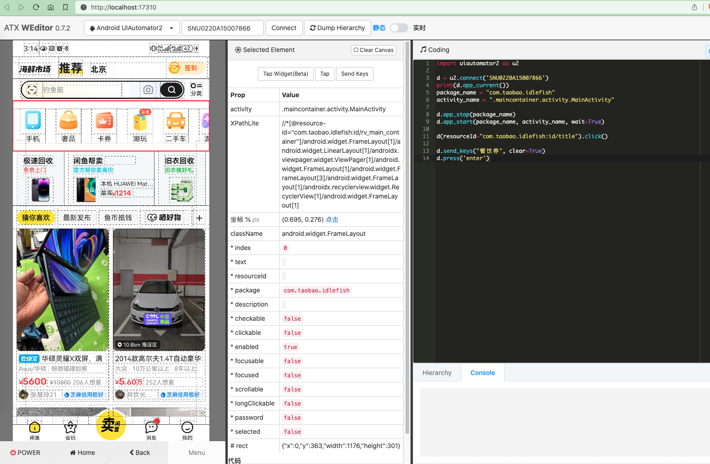
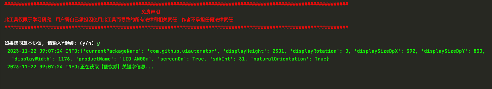
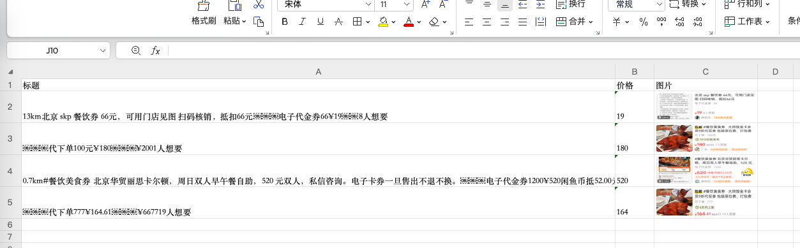

<h1 align="center">闲鱼APP数据爬虫</h1>

<div align="center">

[特性](#特性) | [技术架构](#技术架构) | [快速开始](#快速开始) | [使用说明](#使用说明) | [免责声明](#免责声明) | [常见问题](#常见问题) | [学习交流](#学习交流)

🚀「闲鱼APP数据爬虫」一个基于uiautomator2的闲鱼APP爬虫项目，严禁将所得数据商用！ 本项目只供学习使用，作者不承担任何由此带来的法律风险和损失！如果本项目对你有用，点个Start，方便回顾知识~
<p align="center">
    <a target="_blank" href="https://www.python.org/downloads/release/python-3810/"></a>
    <a target="_blank" href='https://github.com/fangzheng0518/xianyu_spider'></a>
    <a target="_blank" href="LICENSE"></a>
</p>
</div>

# 👻特性

- [x] 支持任意关键词采集
- [x] 支持数据导出Excel
- [x] 支持自定义上滑次数

# ✨技术架构

- Python3.6+
- uiautomator2

# 🚨快速开始

## 1、环境准备

1. clone本项目代码
2. 在项目根目录创建Python虚拟环境venv
    1. `cd xianyu_spider`
    2. `pip install virtualenv`
    3. `virtualenv venv`
3. 安装依赖库`pip install -r requirements.txt`
4. 本次使用的是uiautomator2和USB真机调试，请打开Android手机USB调试模式并连接到电脑
5. 首次通过uiautomator2连接手机时，会自动在手机上安装一个小黄车APP
6. 打开cmd输入`adb devices`获取设备ID

## 2、运行项目

1. 将设备ID输入xianyu.py的`d = u2.connect("设备ID")`中
2. 运行`python xianyu.py`即可进行采集，如需更改采集数据，可更改main函数keyword即可`main(keyword='餐饮券')`

# 🍔使用说明

1. 本次使用的是uiautomator2和USB真机调试，请打开手机USB调试模式并连接到电脑
2. 本次只采集了每个商品的【标题、价格、图片】
3. 如果想采集其他信息，可使用weditor进行调试，自行更改相应代码，命令行输入`weditor`自动打开调试辅助工具
   
4. 程序运行完成后，会在当前目录下生成`YYYY-MM-dd结果.xlsx`

## 运行截图

- 运行截图
  
- 运行结果
  

# 👻常见问题

## 错误：atxagent 下次必须通过adb启动

```shell
电脑USB连接安卓设备；

1. 查看设备是否成功连接：adb devices
   出现的真实设备名称在device前即连接成功；
2. 进入手机shell环境：adb shell
3. 赋予设备权限：chmod 775 /data/local/tmp/atx-agent
4. 后台启动atx-agent： /data/local/tmp/atx-agent server -d
```

## 错误：device显示unauthorized

如果输入`adb devices`显示unauthorized表示usb调试模式授权有问题，按如下方式调整

```shell
1、手机里点击【撤销USB调试授权】
2、电脑上重启adb
 adb kill-server
 adb start-server
3、然后重新连接
```

# 免责声明

请勿将`xianyu_spider`应用到任何可能会违反法律规定和道德约束的工作中，请友善使用`xianyu_spider`，遵守蜘蛛协议，不要将`xianyu_spider`用于任何非法用途。如您选择使用`xianyu_spider`
即代表您遵守此协议，作者不承担任何由于您违反此协议带来任何的法律风险和损失，一切后果由您承担。

# 学习交流

> 扫码入群交流学习，如群二维码失效请加作者微信：FearlessMan888，备注：python群

</img>


